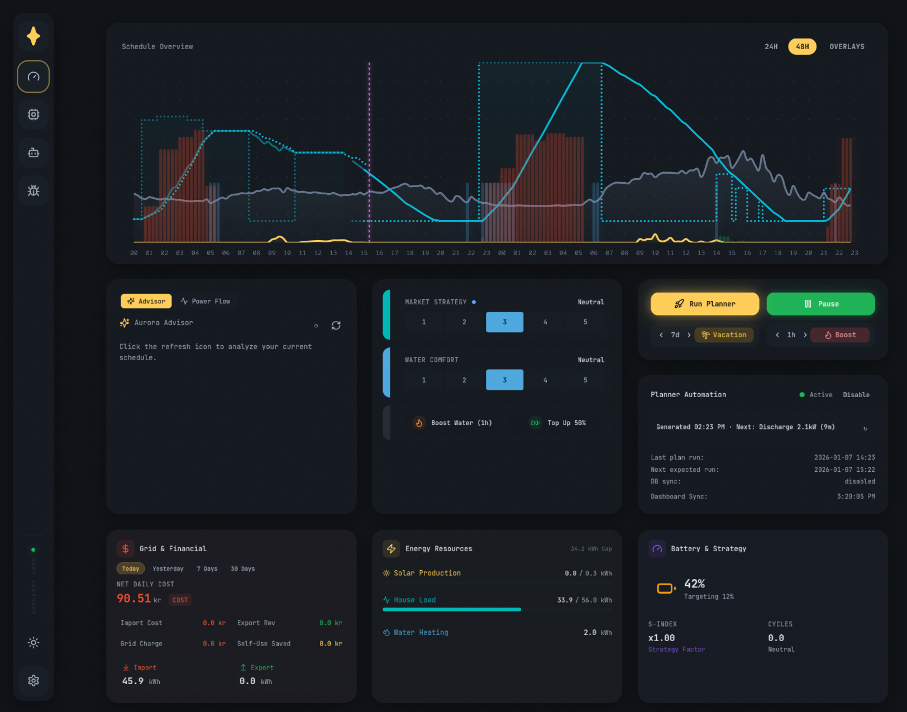

<div align="center">
    <a href="https://github.com/ergetie/darkstar">
        
    </a>
    <br>
    <br>
   <div style="display: flex;">
        <a href="https://github.com/ergetie/darkstar/actions/workflows/ci.yml">
            
        </a>
        <a href="https://github.com/ergetie/darkstar/actions/workflows/build-addon.yml">
            
        </a>
        <a href="https://github.com/ergetie/darkstar/releases">
            
        </a>
    </div>
    <h3>Local AI-powered home battery optimization for solar homes</h3>
</div>

> [!WARNING]
> **PUBLIC BETA**: Darkstar is currently in Public Beta. This software controls high-power electrical equipment. Always maintain human supervision and ensure your Home Assistant safety cut-offs are configured. Use at your own risk!

> [!CAUTION]
> If you're using a Raspberry Pi, ensure you have at least a **Raspberry Pi 4** (RPi 5 recommended).

Darkstar is a local, privacy-first energy management system that optimizes your home battery, solar production, and electricity costs using machine learning (LightGBM) and mathematical optimization (MILP).



## Features

- **Smart Optimization** — Minimizes electricity costs over a 48-hour rolling horizon
- **ML Forecasting** — Learns your home's load and PV production patterns
- **Real-time Execution** — Automatic inverter control via Home Assistant
- **Beautiful Dashboard** — React-based UI with live schedule visualization
- **Self-Learning** — Parameters auto-tune to your home over time
- **Vacation Mode** — Safe anti-legionella water heating while away

## Installation

### Option 1: Home Assistant Add-on (Recommended)

1. Go to **[Settings → Add-ons → Add-on store](https://my.home-assistant.io/redirect/supervisor_store/)**, click **⋮ → Repositories**, fill in</br> `https://github.com/ergetie/darkstar` and click **Add → Close** or click the **Add repository** button below.  
   [](https://my.home-assistant.io/redirect/supervisor_add_addon_repository/?repository_url=https%3A%2F%2Fgithub.com%2Fergetie%2Fdarkstar)
2. Click on **Darkstar Energy Manager** and press **Install**.
3. Start the add-on - Darkstar will **automatically detect** your Home Assistant connection. No manual token required!
4. Click **OPEN WEB UI** and navigate to **Settings** in the sidebar to map your sensors.

### Option 2: Docker Compose

1. Copy `config.default.yaml` to `config.yaml` and `secrets.example.yaml` to `secrets.yaml`.
2. Edit `secrets.yaml` with your Home Assistant credentials.
3. Start with `docker-compose up -d`.
4. Access the UI at **http://localhost:5000**.

## ⚙️ Configuration

### `config.yaml`

Main configuration for your system:

```yaml
# Battery specifications
battery:
  capacity_kwh: 10.0
  min_soc_percent: 15
  max_soc_percent: 95
  max_charge_power_kw: 5.0

# Your Home Assistant sensor mappings
input_sensors:
  battery_soc: sensor.inverter_battery
  total_pv_production: sensor.inverter_pv_total
  total_load_consumption: sensor.inverter_load_total

# Nordpool price area
nordpool:
  price_area: "SE4"
  currency: "SEK"
```

### `secrets.yaml`

Credentials (never committed to git):

```yaml
home_assistant:
  url: "http://your-homeassistant:8123"
  token: "your-long-lived-access-token"

openrouter_api_key: "sk-or-v1-..."

notifications:
  discord_webhook_url: ""  # Optional fallback alerts
```

### Water Heater (Optional)

If you have a smart water heater, Darkstar can optimize its heating schedule. It controls the water heater thermostat temperature with set levels:

```yaml
# In config.yaml under executor:
executor:
  water_heater:
    target_entity: input_number.your_water_heater_temp
    temp_off: 40       # Idle (legionella-safe minimum)
    temp_normal: 60    # Normal scheduled heating
    temp_boost: 70     # Manual boost via Dashboard
    temp_max: 85       # Max temp for PV surplus dumping
```

| Setting | Default | When Used |
|---------|---------|-----------|
| `temp_off` | 40°C | Idle mode, no active heating |
| `temp_normal` | 60°C | Planner schedules heating |
| `temp_boost` | 70°C | You press "Water Boost" button |
| `temp_max` | 85°C | Excess PV with full battery |


## 🏠 Home Assistant Integration

Darkstar reads sensors and controls your inverter through Home Assistant:

**Required Sensors:**
- Battery SoC (%)
- Total PV production (kWh)
- Total load consumption (kWh)

**Controlled Entities:**
- Inverter work mode (export/zero-export)
- Battery charging current limits
- Grid charging switch
- Water heater temperature (optional)

## 📱 Dashboard

The web UI provides:

- **Live Schedule** — 48-hour visualization with charge/discharge/export slots
- **Forecasting** — Compare ML predictions vs. actuals
- **Manual Planning** — Override or extend the automated schedule
- **Settings** — Tune parameters without editing YAML files


## 📊 How It Works

1. **Forecasting** — Aurora ML predicts your home's energy patterns
2. **Strategy** — Context-aware adjustments (vacation mode, weather, etc.)
3. **Optimization** — Kepler solver generates optimal battery schedules
4. **Execution** — Native executor controls your inverter in real-time

The system re-optimizes every hour to adapt to changing prices and conditions.
 
---
 
## 📚 API Documentation
 
Darkstar provides a fully documented REST API. Once running, you can access the interactive Swagger documentation at:
- **http://localhost:5000/docs**
 

## 📄 License

Licensed under the **GNU Affero General Public License v3.0 (AGPL-3.0)**.

