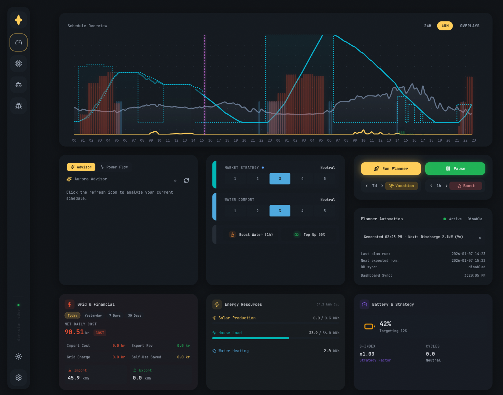

<div align="center">
    <a href="https://github.com/ergetie/darkstar">
        
    </a>
    <br>
    <br>
   <div style="display: flex;">
        <a href="https://github.com/ergetie/darkstar/actions/workflows/ci.yml">
            
        </a>
        <a href="https://github.com/ergetie/darkstar/actions/workflows/build-addon.yml">
            
        </a>
        <a href="https://github.com/ergetie/darkstar/releases">
            
        </a>
    </div>
    <h3>Local AI-powered home battery optimization for solar homes</h3>
</div>

> [!WARNING]
> **PUBLIC BETA**: Darkstar is currently in Public Beta. This software controls high-power electrical equipment. Always maintain human supervision and ensure your Home Assistant safety cut-offs are configured. Use at your own risk!

> [!CAUTION]
> If you're using a Raspberry Pi, ensure you have at least a **Raspberry Pi 4** (RPi 5 recommended).

Darkstar is a local, privacy-first energy management system that optimizes your home battery, solar production, and electricity costs using machine learning (LightGBM) and mathematical optimization (MILP).



## Features

- **Smart Optimization** — Minimizes electricity costs over a 48-hour rolling horizon
- **ML Forecasting** — Learns your home's load and PV production patterns
- **Real-time Execution** — Automatic inverter control via Home Assistant
- **Beautiful Dashboard** — React-based UI with live schedule visualization
- **Self-Learning** — Parameters auto-tune to your home over time. **New:** Automatic ML model retraining.
- **Smart EV Charging** — Intelligent charging optimization that respects your house battery and prioritizes cheap grid hours.
- **Load Disaggregation** — Separates base load from controllable appliances (Water Heater, EV, etc.) for better ML accuracy
- **Vacation Mode** — Safe anti-legionella water heating while away


## Installation

### Option 1: Home Assistant Add-on (Recommended)

1. Go to **[Settings → Add-ons → Add-on store](https://my.home-assistant.io/redirect/supervisor_store/)**, click **⋮ → Repositories**, fill in</br> `https://github.com/ergetie/darkstar` and click **Add → Close** or click the **Add repository** button below.
   [](https://my.home-assistant.io/redirect/supervisor_add_addon_repository/?repository_url=https%3A%2F%2Fgithub.com%2Fergetie%2Fdarkstar)
2. Click on **Darkstar Energy Manager** and press **Install**.
3. Start the add-on - Darkstar will **automatically detect** your Home Assistant connection. No manual token required!
4. Click **OPEN WEB UI** and navigate to **Settings** in the sidebar to map your sensors.

### [DEV] Development Version (Optional)

For testers and developers who want the latest features (and bugs!) from the `dev` branch:
1. Follow the installation steps above to add the repository.
2. In the Add-on Store, look for **[DEV] Darkstar Energy Manager**.
3. **Note**: The Dev version is optimized for **amd64** architecture and updates frequently. It can be installed alongside the stable version for testing.

### Option 2: Docker Compose

1. Copy `config.default.yaml` to `config.yaml` and `secrets.example.yaml` to `secrets.yaml`.
2. Edit `secrets.yaml` with your Home Assistant credentials.
3. Start with `docker-compose up -d`.
4. Access the UI at **http://localhost:5000**.

---

## Getting Started

Once you have installed Darkstar, follow the comprehensive guide to tune the system for your home:

[**👉 Read the Configuration Guide**](docs/SETUP_GUIDE.md)

Already configured? Learn how to operate the system daily:

[**📘 Read the User Manual**](docs/USER_MANUAL.md)

---

## Configuration

### `config.yaml`

Main configuration for your system:

```yaml
# Solar arrays (Up to 6 supported)
system:
  solar_arrays:
    - name: "Roof South"
      azimuth: 180
      tilt: 35
      kwp: 6.5
    - name: "Garage West"
      azimuth: 270
      tilt: 20
      kwp: 4.0

# Your Home Assistant sensor mappings
input_sensors:
  battery_soc: sensor.inverter_battery_soc
  pv_power: sensor.inverter_pv_power
  load_power: sensor.inverter_load_power
  # Darkstar automatically aggregates all production sensors
  # if you use sensor.pv_total or similar integration.

# Nordpool price area
nordpool:
  price_area: "SE4"
```

### `secrets.yaml`

Credentials (never committed to git):

```yaml
home_assistant:
  url: "http://your-homeassistant:8123"
  token: "your-long-lived-access-token"

openrouter_api_key: "sk-or-v1-..."

notifications:
  discord_webhook_url: ""  # Optional fallback alerts
```

### Water Heater (Optional)

If you have a smart water heater, Darkstar can optimize its heating schedule. It controls the water heater thermostat temperature with set levels:

```yaml
# In config.yaml - Entity-Centric Configuration (ARC15)
water_heaters:
  - id: main_tank
    name: "Main Water Heater"
    enabled: true
    power_kw: 3.0
    min_kwh_per_day: 6.0
    max_hours_between_heating: 8
    water_min_spacing_hours: 4
    sensor: sensor.vvb_power
    type: binary
    nominal_power_kw: 3.0

# Control entity for the water heater
executor:
  water_heater:
    target_entity: input_number.your_water_heater_temp
    temp_off: 40       # Idle (legionella-safe minimum)
    temp_normal: 60    # Normal scheduled heating
    temp_boost: 70     # Manual boost via Dashboard
    temp_max: 85       # Max temp for PV surplus dumping
```

| Setting       | Default | When Used                      |
| ------------- | ------- | ------------------------------ |
| `temp_off`    | 40°C    | Idle mode, no active heating   |
| `temp_normal` | 60°C    | Planner schedules heating      |
| `temp_boost`  | 70°C    | You press "Water Boost" button |
| `temp_max`    | 85°C    | Excess PV with full battery    |

### EV Charger (Optional)

Darkstar can optimize EV charging as a deferrable load:

```yaml
# Entity-Centric Configuration (ARC15)
ev_chargers:
  - id: tesla_model_3
    name: "Tesla Model 3"
    enabled: true
    max_power_kw: 11.0
    battery_capacity_kwh: 82.0
    min_soc_percent: 20.0
    target_soc_percent: 80.0
    sensor: sensor.tesla_power
    type: variable
    nominal_power_kw: 11.0
```

### Multiple Devices

You can add multiple water heaters and EV chargers:

```yaml
water_heaters:
  - id: main_tank
    name: "Main Water Heater"
    enabled: true
    # ... settings
  - id: upstairs_tank
    name: "Upstairs Water Heater"
    enabled: true
    # ... settings

ev_chargers:
  - id: tesla
    name: "Tesla Model 3"
    enabled: true
    # ... settings
  - id: fiat
    name: "Fiat 500e"
    enabled: false  # Disabled, won't be used
    # ... settings
```


### Excess PV Dispatch (Optional)

When the battery is full and PV production still exceeds demand, Darkstar can route the surplus into an ordered priority list of sinks instead of exporting it for a low price:

```yaml
executor:
  excess_pv:
    priority:
      - type: ev                     # Send surplus to an EV charger (requires an ev_chargers[] entry with type: current)
        charger_id: tesla_model_3
        surplus_deadband_kw: 0.2      # Deadband for the real-time surplus feedback loop
      - type: water_heater_boost     # Boost water heating above its normal schedule
      - type: custom_entity          # Toggle any other HA entity
        entity: switch.pool_pump
        power_kw: 1.0
    boost_reward_sek_per_kwh: 0.5    # Base reward; each sink below the top gets 15% less by default
    soc_threshold_percent: 95        # Battery must reach this SoC% before any sink activates
```

- **List order is priority order.** The house battery is always implicitly first (gated by `soc_threshold_percent`); the top entry is fed surplus first, and multiple sinks can be active at once when surplus is large enough. An empty (or omitted) `priority` list disables the feature entirely.
- **EV surplus charging** requires the referenced charger to use `type: current` (variable ampere control — see the EV Charger section above) with its own `current_entity` configured. The executor tracks *measured* surplus in real time each tick and modulates the charge current directly; the planner's schedule only marks slots as surplus-*eligible*, it never dispatches an open-loop target.
- **Commanded 1↔3-phase switching**: a 3-phase charger can't charge below ~4.1 kW (6A × 3 phases), so small surpluses (1.4–4.1 kW) go unused unless the charger switches to 1-phase mode. If your charger exposes a phase-mode entity (e.g. the go-e Gemini Flex via its MQTT integration), set `phase_mode_entity`, `phase_switching_enabled: true`, and optionally tune `phase_switch_hysteresis_kw` (default 0.5) and `phase_switch_min_dwell_s` (default 600) on that charger's `ev_chargers[]` entry — the dwell time protects the contactor from rapid switching.
- **Migrating from the old single-sink config**: the legacy `executor.excess_pv.sink: water_heater_boost | custom_entity | disabled` key is migrated automatically on startup into an equivalent one-entry (or empty) `priority` list, and removed. No action needed.

## Home Assistant Integration

Darkstar reads sensors and controls your inverter through Home Assistant:

**Required Sensors:**
- Battery SoC (%)
- Total PV production (kWh)
- Total load consumption (kWh)

**Controlled Entities:**
- Inverter work mode (export/zero-export)
- Battery charging current limits
- Grid charging switch
- Water heater temperature (optional)

## Dashboard

The web UI provides:

- **Live Schedule** — 48-hour visualization with charge/discharge/export slots
- **Forecasting** — Compare ML predictions vs. actuals
- **Manual Planning** — Override or extend the automated schedule
- **Settings** — Tune parameters without editing YAML files


## How It Works

1. **Forecasting** — Aurora ML predicts your home's energy patterns
2. **Strategy** — Context-aware adjustments (vacation mode, weather, etc.)
3. **Optimization** — Kepler solver generates optimal battery schedules
4. **Execution** — Native executor controls your inverter in real-time

The system re-optimizes every hour to adapt to changing prices and conditions.

---

## License

Licensed under the **[GNU Affero General Public License v3.0 (AGPL-3.0)](LICENSE)**.
