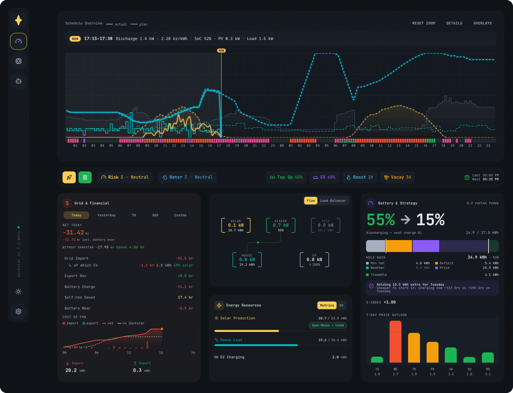

    
     
     
    <h3>Cut your electricity bill. Let Darkstar optimize your battery, solar, EV and water heater!</h3>
    
    
    

 

Darkstar runs next to Home Assistant and decides when your battery should charge, discharge or sit idle, based on electricity prices, the weather and how your home actually uses energy. It also plans your EV and water heater, so the cheap hours are put to work for you.

> [!WARNING]
> **Public beta.** Darkstar controls high-power electrical equipment. Keep your Home Assistant safety cut-offs configured, check on it regularly and use it at your own risk. Not sure yet? Start in **shadow mode**, where Darkstar plans but doesn't control anything.

## Why Darkstar

- **Saves money on autopilot.** It charges when electricity is cheap, uses the battery when it's expensive and holds back energy before expensive days.
- **See what it saves.** The dashboard compares your real cost with a plain self-use inverter, so the saving isn't a guess.
- **Your EV is ready when you need it.** Say "80% by 07:00" and Darkstar finds the cheapest way there, with surplus solar first.
- **One brain for everything.** Battery, solar, EV and water heater are planned together, and your main fuse is protected.
- **Local and private.** It runs on your own hardware with no cloud account or subscription. Your energy history stays at home.
- **Learns your home.** Forecasts for your load, solar and prices improve over time, with no manual tuning.

## Works with

| Inverter | Status |
| --- | --- |
| Deye, SunSynk, Sol-Ark | Supported |
| Fronius GEN24 | Supported |
| Sungrow | Supported |
| Other brands | Generic profile, entities mapped by hand |

- **Electricity prices**: Nordpool.
- **Home Assistant**: Add-on or Docker.
- **EV chargers and water heaters**: Anything controllable from Home Assistant.

More inverters are coming. Missing yours? Ask on [Discord](https://discord.gg/SFnJf4NnMM) or see the [profile creation guide](docs/inverter-profiles/CREATING_INVERTER_PROFILES.md).

## Install

### Home Assistant Add-on (recommended)

1. Add the repository to Home Assistant:
   
2. Install **Darkstar Energy Manager** and start it. It connects to Home Assistant automatically.
3. Click **Open Web UI**. The setup wizard walks you through the rest.

Want the newest features? Install **[DEV] Darkstar Energy Manager** from the same repository. It updates often and can run next to the stable version.

### Docker

1. Copy `config.default.yaml` to `config.yaml` and `secrets.example.yaml` to `secrets.yaml`, then add your Home Assistant URL and access token to `secrets.yaml`.
2. Run `docker-compose up -d`.
3. Open **http://localhost:5000** and follow the setup wizard.

A Raspberry Pi 4 or newer is recommended (Pi 5 preferred).

## Learn more

- **[Configuration Guide](docs/SETUP_GUIDE.md)**: every setting explained.
- **[User Manual](docs/USER_MANUAL.md)**: how to read the dashboard, risk appetite, quick actions and troubleshooting.
- **[Discord](https://discord.gg/SFnJf4NnMM)**: questions, feedback and feature ideas.

## License

Licensed under the **[GNU Affero General Public License v3.0 (AGPL-3.0)](LICENSE)**.
