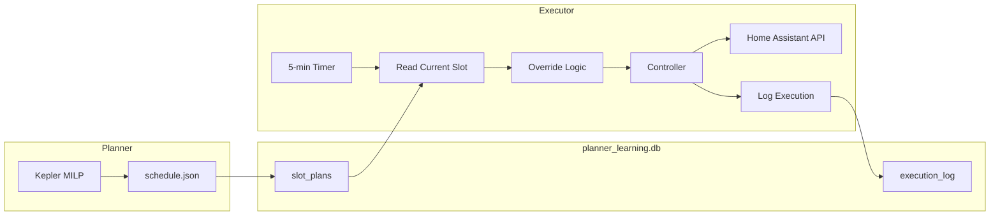

# Darkstar Architecture Documentation

## 1. System Overview
Darkstar is an intelligent energy management system designed to optimize residential energy usage. It uses a **Model Predictive Control (MPC)** approach, combining machine learning forecasts (Aurora) with a Mixed-Integer Linear Programming (MILP) solver (Kepler).

### Core Philosophy
*   **Maximize Value**: Buy low, sell high, and use energy efficiently.
*   **Robustness**: Plan for the worst (High Load/Low PV) using the **S-Index**.
*   **Strategic**: Look ahead (D2+) to make decisions today (Terminal Value).

---

## 2. The Kepler Solver (MILP)
Kepler is the decision-making core. It solves an optimization problem to generate the optimal charge/discharge schedule.

### Objective Function
The solver minimizes the total cost over the planning horizon (typically 24-48 hours):
```
Minimize: Sum(Import_Cost - Export_Revenue + Wear_Cost) - (End_SoC * Terminal_Value)
```

### Key Concepts
*   **Hard Constraints**: Physics limits (Battery Capacity, Inverter Power), Energy Balance.
*   **Soft Constraints**: Terminal Value (Incentivizes ending with charge).
*   **Inflated Demand**: The solver sees a "Safety Margin" inflated load (via S-Index) as hard demand it *must* meet.

---

## 3.  **Strategic S-Index (Decoupled)**:
    To manage risk without "Double Buffering", we decoupled the strategy:

    1.  **Risk Appetite (Sigma Scaling)** — Intra-day Safety:
        *   **Goal**: Buffer against *today's* forecast errors (Uncertainty).
        *   **Mechanism**: User-tunable Sigma Scaling (1-5 Scale).
        *   **Formula**: `Safety Margin = Uncertainty * Sigma(RiskAppetite)`.
        *   **Effect**:
            *   Safety (1): Covers p90 (Worst Case).
            *   Neutral (3): Covers p50 (Mean).
            *   Gambler (5): Covers p25 (Under-provisioning).

    2.  **Dynamic Target SoC (Inter-day Strategy)** — Rev K16:
        *   **Goal**: Prepare for *tomorrow's* risk (Cold/Cloudy D2).
        *   **Mechanism**: FIXED base buffers per risk level + weather adjustment.
        *   **Formula**: `Target % = Min % + Base_Buffer(Level) + Weather_Adjustment`.
        *   **Base Buffers**:
            *   Level 1 (Safety): +35% above min_soc
            *   Level 2 (Conservative): +20%
            *   Level 3 (Neutral): +10%
            *   Level 4 (Aggressive): +3%
            *   Level 5 (Gambler): -7% (below min_soc)
        *   **Weather Adjustment**: ±8% cap based on PV deficit and temperature.
        *   **Guarantee**: Level 1 > Level 2 > Level 3 > Level 4 > Level 5 (ALWAYS).

    3.  **Soft vs Hard Constraints in Kepler**:
        *   **Min SoC (Hard)**: 1000 SEK/kWh penalty - NEVER violate battery safety floor.
        *   **Target SoC (Soft)**: Risk-based penalty (2-20 SEK/kWh) - economics can override.
        *   **Risk Penalty Scaling**:
            *   Level 1: 20 SEK/kWh (hard to violate)
            *   Level 3: 8 SEK/kWh
            *   Level 5: 2 SEK/kWh (easy to trade off for profit)
        *   **Effect**: "Gamblers" will miss target for smaller profit opportunities.

    This ensures we don't inflate today's load just because tomorrow is cold (which caused excessive battery usage in the plan).

---

## 4. Water Heating as Deferrable Load (Rev K17)

The water heater is integrated into Kepler as a **deferrable load**, allowing optimal source selection.

### How It Works
- `water_heat[t]` binary variable in MILP: is heating ON in slot t?
- **Constraint**: Must schedule `min_kwh_per_day` (e.g., 6 kWh)
- **Constraint**: Max gap `max_hours_between_heating` (e.g., 8h)
- Water load added to energy balance → Kepler sources from grid or battery

### Source Selection
Kepler sees the full cost picture and decides:
- **Grid**: If `import_price` is cheap
- **Battery**: If `discharge_price + wear_cost < grid_price`
- **PV**: If surplus available (free!)

### Config
```yaml
water_heating:
  power_kw: 3.0
  min_kwh_per_day: 6.0
  max_hours_between_heating: 8  # Ensure heating every 8h
```

---

## 4.1 Vacation Mode (Rev K19)

When vacation mode is enabled, normal comfort-based water heating is disabled and replaced with periodic **anti-legionella cycles** for safety.

### Behavior
| Mode | Normal Heating | Anti-Legionella |
|------|----------------|-----------------|
| Vacation OFF | ✅ Comfort-based (Kepler) | ❌ |
| Vacation ON | ❌ Disabled | ✅ 3h block weekly |

### Anti-Legionella Cycle
- **Duration**: 3 hours at 3kW = 9 kWh (heats tank to 65°C)
- **Frequency**: Every 7 days
- **Scheduling**: After 14:00 (when tomorrow's prices available), picks cheapest slots
- **Smart Detection**: If water already heated today (≥2 kWh from HA sensor), delays first cycle

### Config
```yaml
water_heating:
  vacation_mode:
    enabled: false  # Toggle via Dashboard or HA entity
    anti_legionella_interval_days: 7
    anti_legionella_duration_hours: 3
```

### State Tracking
Uses `vacation_state` table in `planner_learning.db` to track `last_anti_legionella_at` timestamp.

## 5. Aurora Intelligence Suite
Darkstar's intelligence is powered by the **Aurora Suite**, which consists of three pillars:

### 5.1 Aurora Vision (The Eyes)
*   **Role**: Forecasting.
*   **Mechanism**: LightGBM models predict Load and PV generation with 11 features (time, weather, context).
*   **Uncertainty**: Provides p10/p50/p90 confidence intervals for probabilistic S-Index.
*   **Extended Horizon**: Aurora forecasts 168 hours (7 days), enabling S-Index to use probabilistic bands for D+1 to D+4 even when price data only covers 48 hours.
*   **Config**: `s_index.s_index_horizon_days` (integer, default 4) controls how many future days are considered.

### 5.2 Aurora Strategy (The Brain)
*   **Role**: Decision Making.
*   **Mechanism**: Determines high-level policy parameters (`θ`) for Kepler based on context (Weather, Risk, Prices).
*   **Outputs**: Target SoC, Export Thresholds, Risk Appetite.

### 5.3 Aurora Reflex (The Inner Ear)
*   **Role**: Learning & Balance.
*   **Mechanism**: Long-term feedback loop that auto-tunes physical constants and policy weights based on historical drift.
*   **Analyzers**:
    *   **Safety**: Tunes `s_index.base_factor` (Lifestyle Creep).
    *   **Confidence**: Tunes `forecasting.pv_confidence_percent` (Dirty Panels).
    *   **ROI**: Tunes `battery_economics.battery_cycle_cost_kwh` (Virtual Cost).
    *   **Capacity**: Tunes `battery.capacity_kwh` (Capacity Fade).

---

## 6. Modular Planner Pipeline

The planner has been refactored from a monolithic "God class" into a modular `planner/` package:

```
planner/
├── pipeline.py           # Main orchestrator (PlannerPipeline)
├── inputs/               # Input Layer
│   ├── data_prep.py      # prepare_df(), apply_safety_margins()
│   ├── learning.py       # Aurora overlay loading
│   └── weather.py        # Temperature forecast fetching
├── strategy/             # Strategy Layer
│   ├── s_index.py        # S-Index calculation (dynamic risk factor)
│   ├── windows.py        # Cheap window identification
│   └── manual_plan.py    # Manual override application
├── scheduling/           # Pre-solver Scheduling
│   └── water_heating.py  # Water heater window selection
├── solver/               # Kepler MILP Integration
│   ├── kepler.py         # KeplerSolver (MILP optimization)
│   └── adapter.py        # DataFrame ↔ Kepler types conversion
└── output/               # Output Layer
    ├── schedule.py       # schedule.json generation
    ├── soc_target.py     # Per-slot soc_target_percent calculation
    └── formatter.py      # DataFrame → JSON formatting
```

### Data Flow


1. **Inputs**: Nordpool Prices, Weather Forecasts, Home Assistant Sensors.
2. **Data Prep**: `prepare_df()` + `apply_safety_margins()` (S-Index inflation).
3. **Strategy**: Calculate S-Index, Terminal Value, Dynamic Target SoC.
4. **Scheduling**: Schedule water heating into cheap windows.
5. **Kepler Solver**: MILP optimization for optimal charge/discharge schedule.
6. **SoC Target**: Apply per-slot `soc_target_percent` based on action type:
   - Charge blocks → Projected SoC at block end
   - Export blocks → Projected SoC at block end (with guard floor)
   - Hold → Entry SoC (current battery state)
   - Discharge → Minimum SoC
7. **Output**: `schedule.json` consumed by UI and Home Assistant automation.

### Key Entry Point

```python
from planner.pipeline import PlannerPipeline, generate_schedule

# Production usage
pipeline = PlannerPipeline(config)
schedule_df = pipeline.generate_schedule(input_data, mode="full")
```

**Legacy Reference**: The original 3,600-line heuristic planner is documented in `docs/LEGACY_MPC.md`.

---

## 7. Native Executor

The Executor is a native Python replacement for the n8n "Helios Executor" workflow, enabling 100% MariaDB-free operation.

### Package Structure

```
executor/
├── __init__.py           # Package exports
├── engine.py             # Main ExecutorEngine with 5-min tick loop
├── controller.py         # Action determination from slot plans
├── override.py           # Real-time override logic
├── actions.py            # HA service call dispatcher
├── history.py            # Execution history manager
└── config.py             # Configuration dataclasses
```

### Data Flow



### Key Actions

1. **Inverter Work Mode** - `select.inverter_work_mode`
2. **Grid Charging** - `switch.inverter_battery_grid_charging`
3. **Charge/Discharge Currents** - Battery power limits
4. **SoC Target** - `input_number.master_soc_target`
5. **Water Heater Target** - `input_number.vvbtemp`
6. **Notifications** - Configurable per action type

### Override Logic

The executor includes real-time override logic for edge cases:
- **Low SoC Protection**: Prevents export when SoC is critically low
- **Excess PV Utilization**: Boosts water heating when excess PV available
- **Slot Failure Fallback**: Safe defaults if slot plan unavailable

### Configuration

See `config.yaml` under `executor:` section for all configurable entities and parameters.
