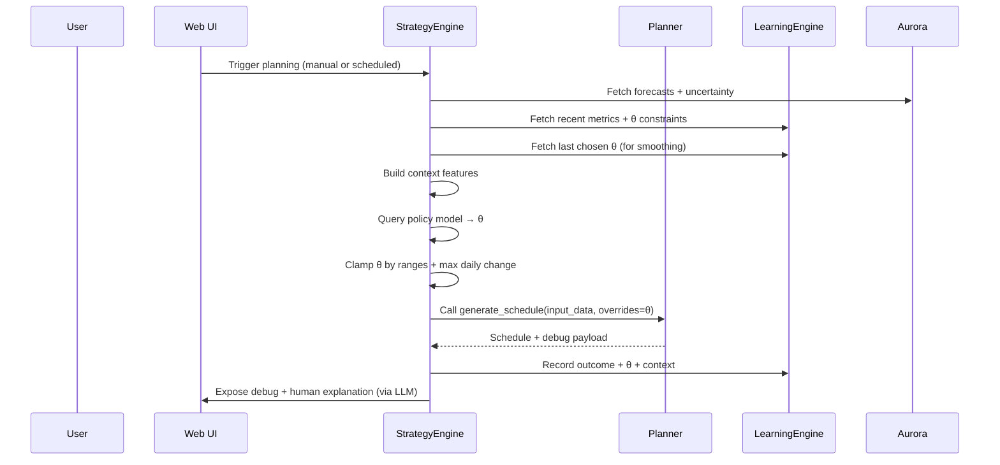

# AURORA Vision: Darkstar as an Intelligent Energy Agent

**AURORA** – **A**daptive **U**sage & **R**enewables **O**ptimization & **R**esponse **A**nalyzer

This document captures the long‑term vision for AURORA as the “brain” of
Darkstar: a fully smart, ML‑driven strategy layer that:

- Learns from real‑world outcomes (Learning Engine).
- Understands the future world (Aurora forecasting).
- Chooses how Darkstar should behave (Strategy Engine + policy learner).
- Always executes through a safe, deterministic planner.

It expands on:

- `docs/aurora_plan.md` – current AURORA implementation plan.
- `docs/aurora_v2_plan.md` – the v2 “AI Agent” revisions (incl. Rev 24).
- `docs/darkstar_architecture_flow.md` – current end‑to‑end system flow.

The aim here is **vision + architecture**, not immediate implementation.

---

## 1. Core Vision & Philosophy

Darkstar today is primarily a **deterministic MPC planner** with a learning
engine and an experimental ML forecasting pipeline (Aurora v0.x).

The long‑term vision is to evolve Darkstar from a **Smart Tool** into an
**Intelligent Agent**:

- The planner remains a **calculator**: given inputs and config, it computes
  a schedule with strict, transparent rules.
- AURORA becomes the **butler / steward**:
  - Observes the home’s context: weather, tariffs, occupancy, habits.
  - Understands uncertainties and risks.
  - Decides how cautious or aggressive Darkstar should be.
  - Learns over time which strategies work for this specific home.

Key principles:

- **Determinism at the core:** All final control actions are produced by the
  existing planner (`planner.py`), which stays rule‑based and explainable.
- **Learning at the strategy layer:** ML does not replace safety logic; it
  chooses policy parameters and overrides within a bounded, validated envelope.
- **Continuous closed‑loop learning:** Every day is a new data point for
  improving forecasts and policy, but change is gradual and constrained.
- **Human‑oriented explainability:** Users should be able to ask “Why?” and get
  meaningful answers in natural language, backed by concrete data.

---

## 2. High‑Level Architecture

### 2.1 Layers Overview

We can structure the future AURORA + Darkstar system into five conceptual layers:

- **Layer 0 – Data & Metrics (Learning Engine)**
  - Centralized SQLite schema (`learning.sqlite_path`).
  - High‑quality slot and daily metrics (`slot_observations`,
    `slot_forecasts`, `learning_daily_metrics`, `learning_runs`,
    `config_versions`, `planner_debug`, etc.).

- **Layer 1 – Forecasting (Aurora as Primary Forecaster)**
  - ML models for load and PV.
  - Shadow‑mode + live forecasting.
  - Explicit uncertainty metrics (variance / error bands).

- **Layer 2 – Policy & Parameter Learner**
  - Learns a mapping from **context → policy parameters θ**.
  - θ includes S‑index weights, charging strategy thresholds, min/max SoC,
    export behavior, water heating policies, etc.

- **Layer 3 – Strategy Engine (“Brain Implant”)**
  - Online inference engine that:
    - Gathers current context.
    - Queries the policy learner.
    - Produces a “Dynamic Config” (overrides) per planning run.
    - Logs decisions (`strategy_log`) for audit and learning.

- **Layer 4 – Evaluation, Guardrails & UX**
  - Dashboards, tools, and safety systems that:
    - Show what the agent is doing and why.
    - Enforce hard safety constraints.
    - Provide rapid rollback to baseline behaviour.

### 2.2 End‑to‑End Flow Diagram

```mermaid
graph TD
    subgraph "Layer 0: Data & Metrics"
        O1[slot_observations] --> L[Learning Engine (learning.py)]
        F1[slot_forecasts] --> L
        L --> DM[learning_daily_metrics]
        L --> LR[learning_runs]
        L --> CV[config_versions]
        PDBG[planner_debug] --> L
    end

    subgraph "Layer 1: Forecasting (Aurora)"
        AUR[ml/ (Aurora models)] --> F1
        AUR --> UF[Uncertainty Features\n(e.g. temp / cloud variance)]
    end

    subgraph "Layer 2: Policy Learner"
        CXT[Context Features\n(prices, weather, season, habits)] --> PL[Policy Learner]
        DM --> PL
        UF --> PL
        PL --> THETA[Policy Parameters θ\n(S-index, thresholds, etc.)]
    end

    subgraph "Layer 3: Strategy Engine"
        THETA --> SE[StrategyEngine\nbackend/strategy/engine.py]
        SE --> OV[Dynamic Config Overrides]
        SE --> SL[strategy_log]
    end

    subgraph "Planner & Execution"
        IN[inputs.py] --> PLNR[Planner (planner.py)]
        OV --> PLNR
        PLNR --> SCHED[Schedule (schedule.json / DB)]
        SCHED --> HA[Home Assistant / Inverter]
    end

    subgraph "Layer 4: Evaluation & UX"
        DM --> DASH[Web UI\nAnalytics & History]
        SL --> DASH
        PDBG --> DASH
        SCHED --> DASH
        DASH --> USER[User]
    end

    HA --> O1
```

### 2.3 Relationship to Existing Docs

- `docs/darkstar_architecture_flow.md` already shows:
  - Data gathering → Planner → Execution → Learning → S‑index.
- This vision extends that diagram by:
  - Making AURORA the main forecast producer (with uncertainty).
  - Treating the Learning Engine as a **policy optimizer**, not just
    a calibrator.
  - Positioning `backend/strategy/engine.py` as the **online agent** that
    injects dynamic behavior into the planner via overrides.

---

## 3. Layer 0 – Data & Metrics (Learning Engine)

The Learning Engine (`learning.py`) remains the **single source of truth** for
historical data and metrics. For a fully smart system, we extend its role:

### 3.1 Core Responsibilities

- **Data consolidation**
  - Maintain `slot_observations`:
    - Import/export/PV/load/water energy, SoC, prices, water heating, etc.
    - Slot‑level resolution (15 min) aligned with NordPool.
  - Maintain `slot_forecasts`:
    - Baseline and Aurora forecasts, per `forecast_version`.
    - Include temperature and other context features.
  - Normalize all timestamps to the configured timezone.

- **Metrics & outcomes**
  - `learning_daily_metrics` becomes the main table for:
    - **Economic metrics**: total cost, import/export energy, export revenue.
    - **Comfort metrics**: min SoC, number of “low‑SoC during peak” events,
      water heating shortages, temperature‑related inconveniences (proxy via
      heating demand).
    - **Risk metrics**: frequency/magnitude of “regret” events
      (e.g. “grid import at high price while battery was unnecessarily low”).
    - **Control metrics**: which policy parameters θ were active that day.

- **Experiment tracking**
  - Use `learning_runs` to track:
    - Time windows, parameter sets, versions of the policy learner.
    - Model performance metrics (e.g. improvement vs baseline).
  - Use `config_versions` to store:
    - Full YAML snapshots of configs / overrides.
    - Reasons and metrics JSON summarizing why a configuration was chosen.

- **Planner debug payloads**
  - Continue writing high‑fidelity debug payloads into `planner_debug`
    (already present).
  - These payloads become key inputs for:
    - Offline analysis (Python / notebooks).
    - LLM‑based explainability (see Section 9).

### 3.2 Additional Metrics for the Vision

To fully support a learning agent, we can extend `learning_daily_metrics` to
capture:

- **Regret‑style metrics**
  - For each day, estimate “how much better we could have done” under a simple
    counterfactual:
    - Example: “If we had raised S‑index by +0.05 yesterday, how much less
      high‑price import would we have had?”
  - These do not have to be perfect; even rough regret estimates help shape
    learning signals.

- **Regime classification**
  - Add tags like:
    - `season`: winter / shoulder / summer.
    - `occupancy_state`: home / away / vacation.
    - `weather_regime`: sunny / cloudy / mixed / storm.
  - These tags become features used by the policy learner to adapt behavior.

- **Battery health proxies**
  - Approximate daily equivalent full cycles, depth‑of‑discharge metrics,
    time spent at high SoC, etc.
  - These can later feed into a “battery wear cost” term in the reward
    function.

---

## 4. Layer 1 – Forecasting (Aurora as Primary Forecaster)

Aurora (`ml/`) already:

- Trains LightGBM models using data from `slot_forecasts` / `slot_observations`.
- Runs in shadow mode and writes `forecast_version`‑tagged forecasts.
- Has paths in `aurora_plan.md` for forward inference and UI visualisation.

In the fully smart vision, Aurora becomes the **primary world model** for
Darkstar.

### 4.1 Forecast Outputs

For each slot in the planner horizon Aurora should eventually provide:

- `load_forecast_kwh_mean`
- `pv_forecast_kwh_mean`
- Optional additional quantiles / bands:
  - `*_p10`, `*_p50`, `*_p90` or
  - `*_mean` + `*_std`

These can be persisted into `slot_forecasts` with extended schema or
encoded into JSON columns.

### 4.2 Uncertainty & Weather‑Driven Metrics

Building on Rev 24 – “The Weather Strategist (S‑Index Weights)” – we want
Aurora + an additional weather module (`ml/weather.py`) to produce metrics like:

- **Cloud cover variance**
  - Per day / per horizon window:
    - High variance ⇒ solar forecast is uncertain ⇒ be more conservative.

- **Temperature variance**
  - Per day / per horizon:
    - High variance ⇒ heating demand and load are uncertain ⇒ raise S‑index
      temp weight or maintain more battery reserve.

- **Error‑based uncertainty**
  - Using historic differences between forecasts and actuals:
    - For each day type (season, regime, weather), compute typical forecast
      error distribution.
    - Expose this to the policy learner as “confidence” features.

These uncertainty signals feed directly into:

- The dynamic S‑index logic, via `pv_deficit_weight`, `temp_weight`, and
  potentially new weights for “uncertainty penalties”.
- The policy learner, as features indicating when to play safe vs aggressive.

### 4.3 Integration Modes

Aurora can be used in three modes:

- **Shadow mode (current state)**:
  - Aurora writes forecasts alongside baseline.
  - Planner ignores Aurora; we only log and compare performance.

- **Advisory mode (intermediate)**:
  - Strategy Engine uses Aurora’s predictions and uncertainties to adjust
    policy parameters θ (e.g. S‑index) without directly changing the
    planner’s core forecast path.

- **Primary mode (full integration)**:
  - Planner explicitly uses Aurora’s forecasts as the main PV/load signals.
  - Baseline forecasts are kept as a safety fallback and evaluation baseline.

In “full AI mode”, we use **Primary + Advisory**:

- Aurora supplies the world model.
- Strategy / policy learner decides how to respond to that world.

---

## 5. Layer 2 – Policy & Parameter Learner (θ)

A central idea is to treat Darkstar’s behavior as driven by a vector of policy
parameters **θ**. The learner’s job is:  
**Given context, choose θ to maximize long‑term reward under constraints.**

### 5.1 What Is θ? (Policy Parameters)

#### 5.1.1 S‑Index Parameters

From both config and planner:

- `s_index.mode` – static/dynamic.
- `s_index.base_factor` – base safety buffer.
- `s_index.max_factor` – maximum allowed buffer.
- `s_index.pv_deficit_weight` – how much PV deficit influences S‑index.
- `s_index.temp_weight` – how much cold temperatures influence S‑index.
- `s_index.temp_baseline_c` – typical comfortable mean temperature.
- `s_index.temp_cold_c` – “very cold” reference point.
- `s_index.days_ahead_for_sindex` – which future days drive S‑index.

The learner can:

- Select the **mode** (static vs dynamic) for this home and season.
- Move `base_factor` and `max_factor` within safe limits.
- Adjust `pv_deficit_weight` based on how PV deficits historically hurt this
  home.
- Adjust `temp_weight` based on how temperature swings matter.
- Learn which `days_ahead_for_sindex` actually correlate with painful events
  (e.g. energy‑intense weekdays vs weekends).

#### 5.1.2 Charging Strategy Parameters

From `config.yaml` and planner logic:

- `charging_strategy.price_smoothing_sek_kwh`
  - How tolerant the planner is around the threshold to avoid over‑fitting to
    fine price differences.
- `charging_strategy.block_consolidation_tolerance_sek`
  - How much price spread is allowed while merging charge slots.
- `charging_strategy.consolidation_max_gap_slots`
  - How many zero‑capacity slots can exist inside one consolidated block.
- `charging_strategy.responsibility_only_above_threshold`
  - Whether to only enforce responsibility (meeting energy targets) when prices
    are above a threshold.
- Additional potential knobs:
  - Aggressiveness of early charging vs last‑minute charging.
  - Export priorities during high‑price periods.

The learner can:

- Increase/decrease smoothing in response to noisy prices.
- Learn how much consolidation is ideal for reducing inverter wear and
  on/off cycling while still seizing price opportunities.
- Decide when it is safe to load responsibility into only very cheap windows,
  versus spreading it more evenly due to uncertainty.

#### 5.1.3 Battery & Comfort Envelopes

Beyond S‑index:

- Min and max SoC bands:
  - Daytime vs nighttime bands.
  - Weekday vs weekend bands.
  - Summer vs winter bands.
- Export preferences:
  - When to allow heavy export vs preserving SoC for evening peaks.
- Comfort thresholds:
  - How low SoC is allowed to go before comfort risk is too high.

The learner can:

- Raise min SoC during seasons or regimes where high‑price peaks are common.
- Lower min SoC when the home repeatedly ends days with too much unused energy.

#### 5.1.4 Water Heating Parameters

From `config.yaml` and water scheduling:

- `water_heating.min_hours` and related parameters.
- Seasonal adjustments to water heating windows.
- Boost behavior before vacations or cold days.

The learner can:

- Find the optimal tradeoff between:
  - Cost (use cheap windows).
  - Comfort (avoid cold showers).
  - Battery usage (don’t starve battery for water unnecessarily).

#### 5.1.5 Strategy Overrides & Modes

High‑level strategy flags:

- Modes like:
  - “Conserve battery”.
  - “Export‑friendly”.
  - “Storm mode”.
  - “Vacation mode plus battery preservation”.
- Per‑mode internal parameters (e.g. more conservative S‑index / SoC bands).

The learner can:

- Decide which mode to activate under which context (season, forecast, user
  preferences).
- Fine‑tune each mode’s internal thresholds.

### 5.2 Context Features

The policy learner uses **context** to choose θ. Context can include:

- **Price context**
  - Price level distribution across the horizon.
  - Price volatility.
  - Presence of clear price spikes or dips.

- **Weather context**
  - Forecasted PV vs load (Aurora).
  - Cloud cover variance and other weather uncertainties.
  - Temperature forecast and variance.

- **Regime context**
  - Season (winter, shoulder, summer).
  - Weekday vs weekend.
  - Holiday indicators.

- **Occupancy context**
  - `vacation_mode`, `alarm_armed_flag`, or equivalent HA states.
  - Typical occupancy patterns derived from load shapes.

- **House profile**
  - Battery size and power limits.
  - PV capacity and orientation.
  - Historical self‑consumption ratios.

- **User preferences**
  - Cost vs comfort vs emissions weighting (from UI).
  - Explicit user strategies: “frugal”, “balanced”, “comfort‑first”.

### 5.3 Learning Approach

We can frame the policy learner as:

- **Contextual bandit / supervised policy**
  - For each day:
    - Input: context features.
    - Output: θ.
    - Reward: daily outcome (cost, comfort, etc.).
  - Benefits:
    - Simpler than full RL.
    - Easier to constrain and debug.

- **Constrained reinforcement learning (future)**
  - Model multi‑day sequences:
    - Account for battery and tariff effects over a week/month.
  - Use constraints to ensure safety (e.g. SoC never below X, max daily change
    in θ bounded).

In both cases:

- θ is always **clamped** to safe ranges before hitting the planner.
- `learning.max_daily_param_change` can be extended from a few scalars to a
  vector, limiting how fast each parameter can change day‑to‑day.

---

## 6. Layer 3 – Strategy Engine (“Brain Implant”)

`backend/strategy/engine.py` is the **online brain** that:

- Runs at each planning invocation.
- Reads context and policy parameters (learned or static).
- Produces a **Dynamic Config** of overrides for the planner.
- Logs its decisions in `strategy_log`.

### 6.1 Responsibilities

- **Context gathering**
  - Prices, weather, Aurora forecasts.
  - HA states (vacation, alarm, occupancy proxies).
  - Current S‑index factor and debug data from the last run.
  - Recent learning outcomes (from `learning_daily_metrics`).

- **Policy application**
  - Query the policy learner model (offline or local).
  - Fetch the current “best guess” θ for today’s context.
  - Enforce:
    - Per‑parameter clamps (min/max).
    - Per‑day change limits.
    - Global safety constraints (e.g. never reduce SoC min below manufacturer
      limits).

- **Override generation**
  - Build a small, explicit overrides dict:
    - S‑index settings (base, max, weights).
    - Charging strategy tweaks.
    - Mode flags and water heating configuration.
  - This dynamic config is passed into `planner.generate_schedule()` as
    `overrides`.

- **Decision logging**
  - Save to `strategy_log`:
    - Timestamp, context snapshot, θ, and rationale (if available).
  - These logs:
    - Provide auditability (“what did the AI do?”).
    - Feed back into LearningEngine as training data.

### 6.2 Strategy Engine Flow Diagram



---

## 7. Layer 4 – Evaluation, Guardrails & UX

To safely run in “AI mode”, we need strong observability and safety controls.

### 7.1 Guardrails

- **Hard constraints in planner**
  - Planner enforces physical, regulatory, and safety constraints:
    - Max grid/battery power.
    - Min SoC floors.
    - Water heating minima.
  - Even if θ is extreme, the planner remains a “safety filter”.

- **Parameter bounding**
  - Every learned parameter has:
    - A conservative default.
    - A min/max range.
    - A max daily change magnitude.

- **Fallback strategies**
  - If the policy learner fails or yields out‑of‑bounds θ:
    - Fallback to:
      - Last known good θ; or
      - A static baseline configuration.

- **Feature‑flagged AI mode**
  - `config.yaml` contains:
    - `strategy.ai_mode` (off / advisory / full).
    - Possibly separate flags for S‑index learning, charging learning, etc.
  - This allows incremental roll‑out:
    - Start with S‑index only.
    - Then allow charging tweaks.
    - Then battery/export/water policies.

### 7.2 Evaluation & Dashboards

- **Daily and weekly summaries**
  - Cost, savings vs baseline.
  - Comfort and risk metrics (low SoC events, cold days).
  - Battery health indicators.

- **Policy history view**
  - Time series of S‑index factors, SoC bands, charging thresholds.
  - Annotations when the policy changed due to learning.

- **Forecast vs actuals**
  - Aurora vs baseline vs real data.
  - MAE / MAPE, segmented by:
    - Weather regime.
    - Occupancy state.
    - Season.

- **Experiment comparisons**
  - A/B comparisons:
    - AI mode vs static baseline.
    - Different risk/comfort settings.

Many of these are already partially in place (e.g. Forecasting tab, learning
history); the vision is to make them central to understanding “what the agent
learned and how it behaves”.

---

## 8. Full “AI Mode” Behavior

### 8.1 Closed‑Loop Control

In AI mode, Darkstar operates as a **continuous closed loop**:

1. **Observe**
   - Collect context:
     - Prices, forecasts, uncertainty.
     - Season, occupancy, HA states.
     - Recent outcomes and policy history.
2. **Decide policy parameters (θ)**
   - StrategyEngine + policy learner produce θ.
   - θ is clamped and smoothed (limited daily change).
3. **Plan & execute**
   - Planner computes schedule using `config.yaml + overrides`.
   - Home Assistant executes actions.
4. **Evaluate**
   - LearningEngine computes per‑day metrics and rewards.
5. **Adapt**
   - Policy learner ingests new data and slightly updates its parameters,
     staying within safety rails.

This loop repeats daily (or per planning run), so the system continually
improves.

### 8.2 Safety & Rules

Even in full AI mode:

- **Domain rules stay first‑class**
  - No learned policy can override physical safety or regulatory constraints.
  - Planner remains the “law”.

- **Parameter envelopes**
  - AI can only operate within a defined envelope:
    - Example: `0.9 ≤ s_index.base_factor ≤ 1.3`, daily change ≤ 0.01.
  - The envelope itself is chosen conservatively by the human operator.

- **Explainable behavior**
  - For each day, the system can answer:
    - “Why did we choose θ today?”
    - “What past events contributed to learning that behavior?”

### 8.3 User Experience

In AI mode, users see:

- **Strategy styles instead of raw knobs**
  - Choose:
    - “Frugal” (cost‑first).
    - “Balanced”.
    - “Comfort‑first”.
    - “Green” (CO₂‑sensitive).
  - Each style maps to different reward weights.

- **Natural‑language explanations**
  - “Today I increased the S‑index slightly because Aurora predicts
    below‑average PV and it will be −8°C in two days. This keeps about 20%
    more battery reserve to avoid expensive grid imports then.”

- **Clear override paths**
  - User can:
    - Temporarily override: “Ignore AI for the next 24 hours.”
    - Pin certain parameters: “Never let SoC fall below 30%.”

---

## 9. Next‑Level Capabilities Beyond EV & Peak Shaving

EV integration and peak shaving are important but relatively obvious next
features. The following ideas aim to push Aurora/Darkstar to a higher level:

### 9.1 Multi‑Objective Optimization

Instead of optimizing for cost only, the policy learner can manage multiple
goals:

- **Cost** – minimize SEK spent on electricity.
- **Comfort** – avoid cold showers, low SoC during high‑usage periods, etc.
- **Emissions** – shift usage to lower‑CO₂ grid periods.
- **Battery health** – penalize deep cycles or long periods at very high SoC.

Users can assign weights:

- Example: `cost: 0.5, comfort: 0.2, emissions: 0.2, battery: 0.1`.

The reward function then becomes:

- `R = w_cost * (-cost) + w_comfort * comfort_score + w_emissions * (-co2) + w_battery * (-wear)`

The policy learner tries to maximize `R` under constraints.

### 9.2 Uncertainty‑Aware Planning & Risk Management

Using Aurora’s uncertainty metrics:

- **Robust planning**
  - When uncertainty is high:
    - Charge more before potential peaks.
    - Avoid overly aggressive export.
  - When uncertainty is low:
    - Exploit price dips more aggressively.

- **User‑level risk modes**
  - “Robust” vs “Aggressive” vs “Balanced” risk preferences:
    - Robust: prefer to be slightly over‑charged ahead of time.
    - Aggressive: willing to risk last‑minute charging if forecasts are usually
      accurate.

### 9.3 Automatic Seasonal / Regime Detection

The Learning Engine can cluster days into regimes:

- **Seasonal regimes**
  - Winter: heating‑dominated, low PV.
  - Shoulder: mixed conditions.
  - Summer: high PV, possible cooling load.

- **Behavioral regimes**
  - Workdays vs weekends.
  - Vacation vs home.

The policy learner can maintain:

- Different θ distributions per regime.
- Faster learning within a regime, slower across regimes (prevent “forgetting”
  winter behavior during summer).

### 9.4 Residential Micro‑Grid Behaviors (Future / Experimental)

If multiple Darkstar nodes exist in a neighborhood:

- Coordinate exports to avoid overloading local transformers.
- Share information:
  - Local voltage or grid constraints.
  - Collective CO₂ or cost objectives.

Initially this can be purely simulated (“virtual neighborhood”) to stress‑test
policies and evaluate community‑level benefits.

### 9.5 Battery & System Health Analytics

Using observations and planner debug data:

- Infer a simple degradation model:
  - Based on cycles, depth‑of‑discharge, temperature.
- Estimate **battery wear cost per kWh** of throughput.
- Incorporate that into the reward function and UI:
  - “This export pattern saves 10 SEK but costs 2 SEK in battery wear.”

### 9.6 High‑Fidelity “Lab” / Scenario Engine

Extend “The Lab” (Rev 21 – Simulation Playground) to:

- Run multi‑day and multi‑scenario simulations:
  - New tariff contracts.
  - Battery expansions.
  - PV tilts/capacity changes.
  - Different user strategies.

- Use Aurora + planner as a **what‑if simulator**:
  - Provide ROI estimates for:
    - Hardware upgrades.
    - Tariff swaps.
    - Lifestyle changes.

### 9.7 Auto‑Tuning for Lifestyle / Family Profile

The system can infer “comfort curves” from actual behavior:

- How often users override settings.
- How low they allow SoC to go before intervening.
- When they tend to use hot water.

Over time:

- The system internalizes these preferences and adjusts θ so that:
  - Fewer manual overrides are needed.
  - Policies feel “natural” for that specific household.

---

## 10. Dream‑Level System Vision

If we could build the ideal system without constraints, AURORA/Darkstar would
be:

### 10.1 Personal Energy Steward

Instead of a scheduler, Darkstar becomes a **personal energy steward**:

- Understands:
  - Your calendar (vacations, events).
  - Your habits (wake/sleep, appliances).
  - Your tolerance for comfort tradeoffs.
- Anticipates:
  - Cold waves, heat waves, storms.
  - High price periods.
  - Special events (guests, parties).

It then coordinates energy usage accordingly, with minimal micromanagement from
you.

### 10.2 Full‑Stack Optimization

The system optimizes:

- Across **all controllable assets**:
  - Battery, water heater, HVAC, EVs, flexible appliances.
- Across **multiple horizons**:
  - Short term (next 24–48 hours).
  - Medium term (weekly).
  - Long term (monthly, yearly).
- Across **multiple objectives**:
  - Cost, comfort, emissions, hardware longevity.

### 10.3 Self‑Configuring and Self‑Healing

The system:

- Auto‑detects hardware and capabilities from patterns.
- Identifies mis‑wired or mis‑scaled sensors (e.g. sign errors, wrong units).
- Suggests corrections or, where safe, applies them automatically.

### 10.4 Deep Explainability

Every major decision can be:

- Traced back to:
  - Inputs (prices, forecasts, context).
  - Policy parameters θ.
  - Historical episodes which trained those behaviors.
- Explained in human language:
  - “We chose high S‑index this week because in similar past weeks, the
    battery frequently ran low during cold evening peaks, causing expensive
    imports.”

### 10.5 Hierarchical Intelligence

Three conceptual layers of intelligence:

- **Low‑level**: Today’s planner (MPC).
  - Guarantees feasibility and respects physical constraints.
- **Mid‑level**: Policy learner (θ).
  - Adapts daily/weekly behavior.
- **High‑level**: Long‑horizon planner/advisor.
  - Proposes:
    - Tariff changes.
    - Hardware upgrades.
    - Behavioral shifts (e.g. “run dryer earlier on sunny days”).

### 10.6 Mostly Local, Privacy‑Respecting

- Core control and learning logic runs locally (on a server or NAS).
- Cloud usage, if any, is:
  - Optional.
  - Focused on heavy‑duty ML training or LLM features, not basic control.

---

## 11. LLM Integration: Beyond “Smart Advisor”

Rev 23 (“The Voice”) already added a Smart Advisor card driven by an LLM.
We can extend LLM usage in several directions while keeping core control
logic in deterministic Python.

### 11.1 Config & Policy Co‑Pilot

Use an LLM as a translator between user intent and numeric config:

- User says:
  - “I can tolerate slightly colder house on weekdays if it saves money.”
  - “I’m okay with more aggressive export on sunny weekends.”
- LLM maps this to:
  - Adjusted reward weights.
  - S‑index envelopes.
  - Charging/export preferences.
- System:
  - Proposes a config diff in UI.
  - Lets the user approve before applying.

### 11.2 Explainability & Forensics

Feed `planner_debug`, `strategy_log`, and `learning_daily_metrics` to LLM
prompts to generate:

- Post‑hoc explanations:
  - “Why was my bill unusually high on Tuesday?”
  - “Why did you not discharge more yesterday at 19:00?”
- Weekly digests:
  - “Where did we save money this week?”
  - “Which days were the most expensive and why?”

The LLM does not invent data; it just reframes and summarizes existing metrics.

### 11.3 Simulation Narrator

In an extended “Lab”:

- After running multiple scenarios (e.g. different battery sizes or tariffs),
  an LLM can:
  - Summarize differences.
  - Explain tradeoffs in plain language.
  - Provide narrative “what if” reports:
    - “With a 10 kWh battery, you’d reduce winter imports by X and summer
      exports by Y; estimated payback is ~Z years under current tariffs.”

### 11.4 Anomaly & Event Interpreter

Combine numeric anomaly detection with LLM summaries:

- System identifies anomalies:
  - Spikes in load at unusual times.
  - Unexpected export/import patterns.
- LLM turns them into understandable alerts:
  - “Yesterday between 02:00–03:00, your consumption was twice normal;
    consider whether an appliance was left on.”

### 11.5 Long‑Form Energy Journaling

Monthly or seasonal reports:

- Summarize:
  - Performance vs last month/year.
  - How Aurora’s forecast accuracy evolved.
  - What the policy learner changed.
  - Concrete suggestions for further improvement.

LLM can generate these narrative reports from metrics and logs.

### 11.6 Developer Helper Inside the System

For maintainers:

- Describe new rules or strategy ideas in natural language.
- LLM generates:
  - Draft Python code for `StrategyEngine`.
  - Suggested config schema additions.
  - Test scenarios.

These remain drafts; a human developer reviews and integrates them.

### 11.7 Cross‑Domain Integration

LLMs can interpret semi‑structured inputs:

- Calendar events:
  - “Vacation from 14th to 21st” → structured `VacationMode` window.
- Emails or notes:
  - “Hosting guests this weekend” → temporary comfort‑first mode.

LLM parses these into structured overrides or config changes that the
Strategy Engine can act on.

---

## 12. Roadmap Sketch (Conceptual)

This vision can be implemented incrementally:

1. **Strengthen Layer 0 & 1**
   - Ensure data quality in `slot_observations`.
   - Extend Aurora with uncertainty metrics.
   - Add regime tags and richer daily metrics.
2. **Introduce a simple policy learner**
   - Start with S‑index base/max and weights only.
   - Use contextual bandit or supervised mapping from context → θ.
   - Enforce strong bounds and small daily changes.
3. **Expand θ**
   - Gradually include:
     - Charging strategy thresholds.
     - Min/Max SoC bands.
     - Water heating parameters.
4. **Enhance Strategy Engine**
   - Centralize context gathering.
   - Standardize override format.
   - Improve logging (`strategy_log`).
5. **Build guardrails & dashboards**
   - Parameter history, explainability views, and safe rollbacks.
6. **Layer in richer LLM usage**
   - Config co‑pilot, explainability, simulation narration.
7. **Experiment with advanced features**
   - Multi‑objective optimization.
   - Seasonal regime‑specific policies.
   - Micro‑grid simulations.

This roadmap preserves safety and transparency at each step, while steadily
moving Darkstar towards the full intelligent agent described in this
document.

