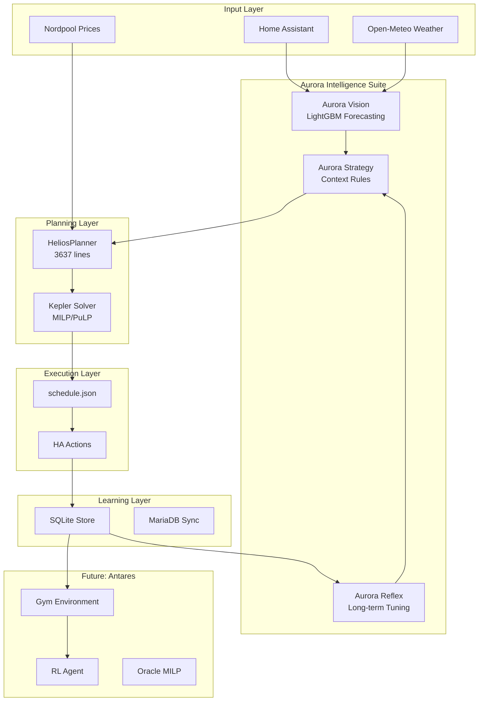

# 🌟 Darkstar Energy Manager: Architectural Review & Brainstorm

**Date:** December 4, 2025  
**Reviewer:** Opus 4.5 (Gemini)  
**Scope:** Full system analysis, vision alignment, improvement opportunities

---

## 📋 Executive Summary

Darkstar is an ambitious residential energy management system that is extremely well-designed architecturally. The vision documents are coherent, the naming convention ("Aurora" as the intelligence suite) is elegant, and the core philosophy—**deterministic optimization + learning strategy layer**—is the right approach for safety-critical home automation.

After reviewing all documentation and the codebase, I've identified:
- **What's Missing:** Key gaps in the current architecture
- **What to Improve:** Areas that could be enhanced
- **What to Remove:** Potential simplifications
- **New Ideas:** Brainstormed innovations across UX, ML, planning, and AI

---

## 🏗️ Current Architecture Overview



---

## 🔍 What's Missing?

### 1. **Uncertainty Quantification** 📊 — HIGH PRIORITY
Aurora Vision produces point forecasts, but no confidence intervals or probabilistic outputs.

| Gap | Impact |
|-----|--------|
| No p10/p50/p90 bands | Can't do risk-aware planning |
| No weather uncertainty propagation | S-Index is heuristic, not probabilistic |

#### Probabilistic S-Index Explained

Currently, S-Index uses a **heuristic formula**:
```
S-Index = base_factor + pv_deficit_weight * PV_Deficit + temp_weight * Temp_Factor
```

This is a hand-tuned "gut feeling" approach. A **probabilistic S-Index** would instead:

1. **Use forecast distributions**: Instead of single PV/Load forecasts, use p10/p50/p90 bands
2. **Calculate exceedance probability**: "What's the probability we run out of battery before 18:00?"
3. **Set buffer based on risk tolerance**: If user wants 95% safety, size buffer to cover p95 demand

**Benefits:**
- More principled than arbitrary weights
- Adapts automatically to forecast accuracy (poor forecasts → wider bands → larger buffer)
- User can tune "risk appetite" (90% vs 99% safety) instead of abstract `base_factor`

**Top 3 Uncertainty Implementation Options:**
1. **Quantile Regression in LightGBM** — Train separate p10/p50/p90 models (easiest)
2. **Conformalized Prediction** — Post-hoc calibration with guaranteed coverage
3. **Residual Distribution** — Track forecast errors, fit a distribution, use for bands

---

### 2. **Multi-Horizon Planning** 🗓️ — MEDIUM PRIORITY

Current system plans 48h. No weekly/monthly optimization exists.

#### Why Look Beyond Tomorrow When Prices Only Go 24-48h?

Great question! The value isn't in knowing exact future prices, but in **strategic preparation**:

| Scenario | Benefit of Weekly Lookahead |
|----------|------------------------------|
| Cold spell in 3 days | Start building battery buffer early |
| Weekend sunny forecast | Defer non-urgent charging to capture free solar |
| Monthly billing peak | Shave peaks throughout month, not just today |
| Tariff with seasonal rates | Different strategy winter vs summer |

**The key insight**: Weather forecasts go 7+ days out with reasonable accuracy. Even without exact prices, you can anticipate:
- High-price risk (cold + cloudy = expensive imports likely)
- Export opportunities (sunny weekends = high solar, low demand)

**Implementation Options:**
1. **Terminal Value Learning** — Antares learns "what SoC is worth at end of horizon"
2. **Scenario Trees** — Sample plausible price paths from historical patterns
3. **Rolling Horizon** — Plan 168h with decreasing resolution (15min→1h→4h)

---

### 3. **EV Integration** ⚡ — LOW PRIORITY (Owner note: No EV yet)

*Kept for future reference when an EV is acquired.*

| Gap | Suggestion |
|-----|------------|
| No EV charging model | Add EV as first-class "dispatchable load" |
| No departure time constraints | Integrate Google Calendar or smart plug APIs |
| No V2H (Vehicle-to-Home) | Model EV as secondary battery |

---

### 4. **HVAC Integration** 🌡️ — LOW PRIORITY (Owner note: No controllable HVAC)

*Kept for other users who might fork/use Darkstar.*

| Gap | Suggestion |
|-----|------------|
| No heat pump optimization | Add HVAC as controllable load with thermal model |
| No thermal model of house | Pre-heat/pre-cool based on price predictions |

---

## 📈 What Can We Improve?

### Aurora Vision (Forecasting)

| Current State | Improvement | Priority |
|---------------|-------------|----------|
| Single LightGBM model | **Ensemble or seasonal models** | Medium |
| PV clamps are hardcoded (17:00-07:00) | **Astro-aware sunrise/sunset** ✅ | High |
| No online learning | **Incremental model updates** | Medium |

#### Astro-Aware PV (Quick Win)
Use `ephem` or `astral` library to calculate actual sunrise/sunset for the location. Benefits:
- Summer: Capture PV from 05:00-21:00
- Winter: Correctly zero out PV from 16:00-08:30
- No more manual seasonal adjustments

---

### Aurora Strategy (The Brain)

| Current State | Improvement | Priority |
|---------------|-------------|----------|
| Hardcoded thresholds (>1.5 SEK spread) | **Learned thresholds per household** | Medium |
| Only 2 modes (Aggressive/Conservative) | **Continuous policy space** | Low |
| Vacation/Weather only | **Calendar integration** | Medium |

---

### Aurora Reflex (Auto-Tuning) — 🔴 HIGHEST PRIORITY

| Current State | Problem |
|---------------|---------|
| `analyze_safety()` returns placeholder | Never actually tunes `s_index.base_factor` |
| `analyze_confidence()` only logs MAE | Doesn't tune `pv_confidence_percent` |
| `analyze_roi()` is empty | Never tunes `battery_cycle_cost_kwh` |
| `analyze_capacity()` is empty | Never detects capacity fade |
| No bounds on updates | Could drift to extreme values |
| No drift detection | Silent failures possible |

**See Rev K12 in PLAN.md for detailed completion plan.**

---

### Kepler (MILP Solver)

| Current State | Improvement | Priority |
|---------------|-------------|----------|
| PuLP with CBC | Consider HiGHS for speed | Low |
| Fixed 15-min resolution | Adaptive resolution (future) | Low |

---

### UI/UX — HIGH PRIORITY

| Current State | Improvement | Priority |
|---------------|-------------|----------|
| React web app | **Mobile-first PWA** | High |
| Static charts | **Real-time streaming updates** | Medium |
| No "why" explanations | **LLM chat interface** | Medium |

**Top 3 UX Improvements:**
1. **Energy Flow Animation** — Sankey diagram with live power flows
2. **"Why?" Button** — Click any decision and get an explanation
3. **Push Notifications** — Price spikes, low SoC alerts via mobile

---

## ❌ What Could We Remove/Simplify?

### 1. **Legacy MPC Complexity** — HIGH PRIORITY (Needs Discussion)

The 3637-line `planner.py` contains the full legacy heuristic MPC. If Kepler is now primary:

> [!TIP]
> **Consider:** Archive the 7-pass heuristic logic to a separate module. Keep only the Kepler path in `planner.py`.

**How to preserve comparison capability:**
1. Move legacy MPC to `planner_legacy.py` 
2. Keep a `benchmark_mode` flag that runs both planners
3. The Lab can compare Legacy vs Kepler on historical days
4. Once Kepler is proven superior over 6+ months, deprecate legacy entirely

---

### 2. **Dual Storage (SQLite + MariaDB)**

> [!TIP]
> **Consider:** Make MariaDB the single source of truth with SQLite as offline cache only.

---

## 💡 New Ideas & Innovations

### 🧠 Foundation Model for Home Energy

**Concept:** Train a small transformer on hourly (load, PV, price) sequences from many homes. Fine-tune on your home.

**How it would work:**
1. **Pre-training**: Collect anonymized data from 100+ Darkstar/other installations
2. **Architecture**: Small transformer (e.g., 6 layers, 128 dim) that predicts next 24h
3. **Fine-tuning**: When installed on your home, fine-tune on your data (cold-start: 7 days)
4. **Benefits**: 
   - Captures universal patterns (weekday vs weekend, seasonal, weather response)
   - Your home only needs to learn *deviations* from typical behavior
   - Much faster learning than training from scratch

**Comparison to current approach:**
| Current (LightGBM from scratch) | Foundation Model |
|--------------------------------|------------------|
| Needs 3-6 months of data | Usable after 1 week |
| No transfer learning | Leverages other homes' patterns |
| Simple features | Learns complex temporal patterns |
| Fast inference | Slightly slower but richer |

---

### 🧪 Synthetic Data Augmentation

**Concept:** Generate realistic price spikes, weather events, and extreme days to train robust policies.

**Is this for RL?** Yes, primarily for Antares RL training.

**How does it compare to training on historic data?**

| Historic Data Training | Synthetic Augmentation |
|------------------------|------------------------|
| Only experiences events that happened | Can generate rare but important scenarios |
| Limited extreme events (one polar vortex in 3 years) | Can generate 1000 extreme cold days |
| Risk of overfitting to specific past | Tests generalization |
| ✅ Real and trustworthy | ⚠️ May not match real dynamics |

**Best practice:** Use 80% real + 20% synthetic augmented data.

---

### 📊 Causal Inference for Savings Attribution

**Concept:** Build a causal model to answer: "How much did Aurora *actually* save vs. a baseline?"

**Isn't this what MPC vs Kepler comparison does?**

Not quite! The current comparison answers: "Which algorithm is better?"

Causal inference answers: "How much money did *this system* save compared to *not having it at all*?"

This requires a **counterfactual baseline**:
- What would consumption/cost be with a "dumb" static strategy?
- How much of the savings is Aurora vs. just having a battery?
- How much is price arbitrage vs. solar self-consumption?

**Implementation idea:** Run a "shadow baseline" strategy in parallel (simple rules) and compare costs.

---

## 🎯 Priority List

Based on owner feedback, here is the prioritized roadmap:

### 🔴 P1 — Critical (Do Now)
1. **Complete Aurora Reflex** — The analyzers are placeholders, defeating the learning loop purpose

### 🟠 P2 — High (Next Quarter)
2. **Planner Refactoring** — Split the 3637-line `planner.py`, preserve comparison capability
3. **UX Improvements** — Mobile PWA, energy flow visualization, better explanations

### 🟡 P3 — Medium (This Year)
4. **Astro-aware PV** — Quick win, use sunrise/sunset instead of hardcoded hours
5. **Probabilistic Forecasting** — Add p10/p50/p90 bands for risk-aware S-Index
6. **UI Vision Document Expansion** — Flesh out the 37-line UI_VISION.md with mockups

### 🟢 P4 — Low (When Resources Allow)
7. **Multi-Horizon Planning** — Weekly lookahead with weather-based strategy
8. **Calendar Integration** — Pull events for proactive planning
9. **Foundation Model** — Transfer learning from multi-home dataset

### ⚪ P5 — Future / Parked
10. **EV Integration** — When owner acquires an EV
11. **HVAC Integration** — For other users with controllable HVAC

### ❌ Excluded
- ~~Grid Services / Demand Response~~ — No integration available or needed

---

*This review is a brainstorming artifact. Feedback from owner has been incorporated.*
